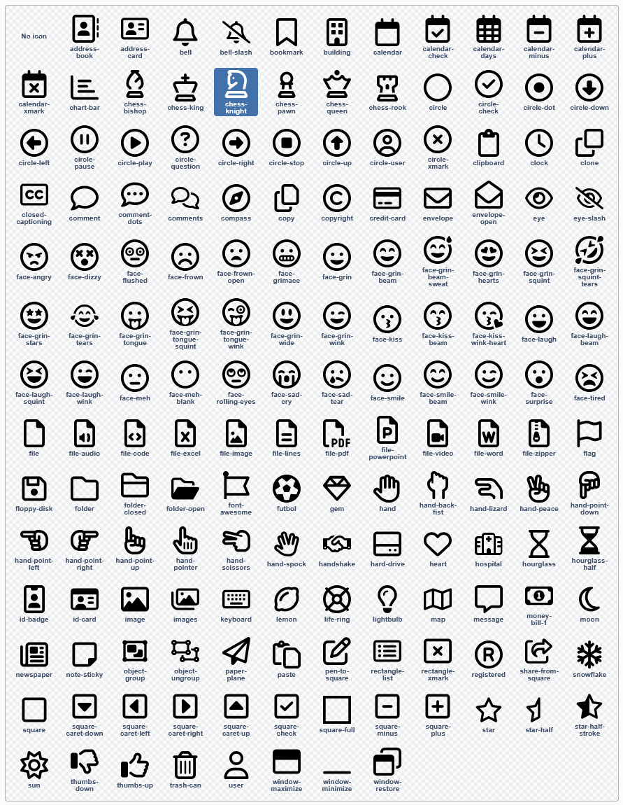

# SVG Sprite Icon Field

[](https://packagist.org/packages/innoweb/silverstripe-svg-sprite-icon-field)
[](license.md)

## Introduction

This module adds an icon selector field to Silverstripe that uses an SVG sprite.

The module is based on [jaedb/iconfield](https://github.com/jaedb/IconField), but it uses an SVG sprite instead of individual images.

By default, the free version of the FontAwesome regular icons are used.



## Requirements

* Silverstripe ^5
* PHP DOM extension (ext-dom)

## Installation

Install the module using composer:
```
composer require innoweb/silverstripe-svg-sprite-icon-field
```
Then run dev/build.

## Configuration

The module uses the following configuration options:

```yaml
Innoweb\SvgSpriteIconField\Icon:
  icon_sprite: 'public/_icons/sprite.svg' # The path to the SVG sprite. 
                                          # Can be a module resource or relative path. 
                                          # Default: 'innoweb/silverstripe-svg-sprite-icon-field: client/icons/fontawesome-regular-free.svg'
  
  icon_width: '20' # The width of the icon used in the frontend. 
                   # Default: 16
  
  icon_height: '20' # The height of the icon used in the frontend. 
                    # Default: 16
  
  css_class: 'YourIconClass' # The CSS class used in the frontend. 
                             # Default: 'SpriteIcon'
```

## Usage

Add an icon field to your DataObject:

```php
use Innoweb\SvgSpriteIconField\Icon;

...

private static $db = [
    'Icon' => Icon::class,
];
```

Then add the form field to your DataObject:

```php
public function getCMSFields()
{
    $fields = parent::getCMSFields();

    ...
    
    $fields->push(
        IconField::create('Icon', 'Icon')
    );
    
    ...

    return $fields;
}
```

In your template, you can then use the field like so:

```html
$YourObject.Icon
```

I recommend adding the following default CSS to your project:

```css
.SpriteIcon {
    display: inline-block;
    width: 1em;
    height: 1em;
    stroke: currentColor;
    fill: currentColor;
}
```

You can also change the colour of the icon by using CSS:

```css
.SpriteIcon {
    fill: red;
    stroke: red;
}
```

And you can change the size of the icon by using CSS:

```css
.SpriteIcon {
    font-size: 3em;
}
```

And of course you can override the template `Innoweb\SvgSpriteIconField\Icon` in your theme if you like.

## Changelog

See [Changelog](changelog.md)

## License

BSD 3-Clause License, see [License](license.md)

## Credits

* [jaedb](https://github.com/jaedb), for writing the [original module](https://github.com/jaedb/IconField)
* [PlasticStudio](https://github.com/PlasticStudio), for their SS5 upgrade and improvements

